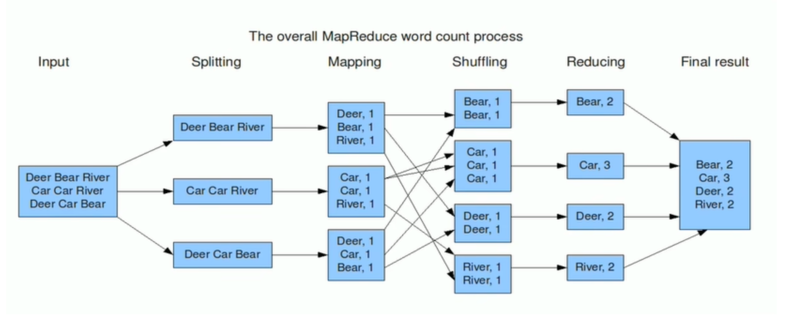
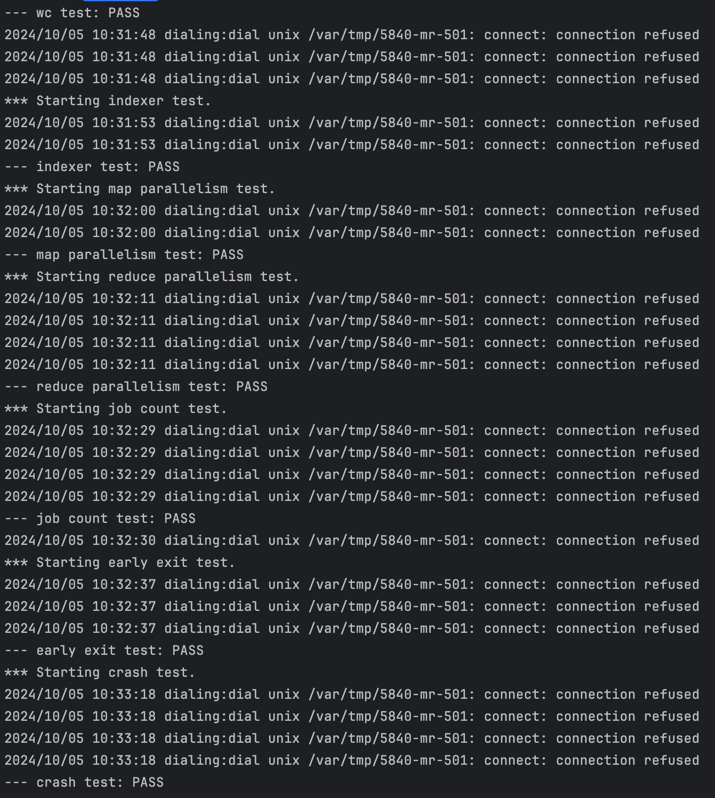

# Mit_6.824
Mit_6.824(6.584) lab1

课程地址：https://pdos.csail.mit.edu/6.824/schedule.html

概述：

什么是分布式系统：多个计算机节点通过网络连接在一起，协同工作共同的任务，每个节点可以是物理上独立的计算机，但它们一起表现得像一个单一的系统

为什么要构建分布式系统：

1. 可靠性：单一节点崩溃不影响全部系统
2. 提高性能和处理能力：
3. 负载均衡：大量请求分发
4. 地理性：部署全球节点

Lab1：实现一个MapReduce分布式系统

MapReduce论文:https://static.googleusercontent.com/media/research.google.com/zh-CN//archive/mapreduce-osdi04.pdf

初始代码仓库：

```tex
git clone git://g.csail.mit.edu/6.5840-golabs-2024
```

任务要求和提示都可以在课程地址中找到。



实现思路：

首先可以根据论文中的7个步骤，包括学习示例的mrcoordinator.go来尝试：

1. **输入数据分片与程序启动**：
    - 将输入数据按块划分成 M 片（通常 16MB 到 64MB 每片，用户可调整），然后在集群上启动多个程序副本，其中一个是主节点，负责调度任务，其他是工作节点。
2. **主节点分配任务**：
    - 主节点（Master）负责分配任务。集群中有 M 个 Map 任务和 R 个 Reduce 任务。主节点选择空闲的工作节点，分配给它们 Map 或 Reduce 任务。
3. **Map 任务执行**：
    - 被分配到 Map 任务的工作节点读取输入数据块，将其解析为键/值对，然后将其传递给用户定义的 Map 函数。产生的中间键/值对会暂时缓存在内存中。
4. **中间数据的分区与存储**：
    - 缓存的中间数据定期写入本地磁盘，并按 R 个分区函数进行划分。中间数据的存储位置会报告给主节点，主节点再将这些位置通知给 Reduce 任务。
5. **Reduce 任务读取中间数据**：
    - Reduce 工作节点接到主节点通知后，通过远程过程调用（RPC）从 Map 工作节点的本地磁盘读取中间数据。读取完毕后，按照中间键对数据进行排序，确保相同键的所有数据分组到一起。如果数据过大，使用外部排序。
6. **Reduce 任务处理与输出**：
    - Reduce 工作节点遍历排序后的中间数据，针对每个唯一的中间键，调用用户定义的 Reduce 函数，处理结果将追加到对应分区的最终输出文件中。
7. **任务完成与程序返回**：
    - 当所有 Map 和 Reduce 任务完成后，主节点通知用户程序任务已结束，MapReduce 调用返回结果。

1、根据txt的文件数量进行切片，切分为8个

记录一下完成实验中产生的问题和思考：

中间文件：

```tex
("hello", "1")
("world", "1")
("hello", "1")
("foo", "1")
("bar", "1")
("foo", "1")
```

处理后：

```tex
kvs = {
	"hello": ["1", "1"],
	"world": ["1"],
	"foo":   ["1", "1"],
	"bar":   ["1"]
}
```

reducef：

```
result = {
    "hello": "2",
    "world": "1",
    "foo":   "2",
    "bar":   "1"
}
```

问题1：管道缓冲问题，对go中的管道特性不了解导致的

问题2：dialing:dial unix /var/tmp/5840-mr-1000: connect: connection refused（这应该是访问coordinator时没反应挂起，提示里写到出现少量的这样的报错是正常的，包括我最后的结果里也有这样的报错）

问题3: crash-test中fail，原因：

```go
if args.WorkerState == Idle {
		if len(c.mapCh) > 0 {
			filename := <-c.mapCh
			c.mapState[filename] = Allocated
			reply.TaskType = "map"
			reply.FileName = filename
			reply.MapId = c.generateMapId()
			c.workerTasks[workerId] = TaskInfo{"map", filename}
			log.Printf("mapCh length: %d", len(c.mapCh))
			c.checkHeartBeat(workerId)
			return nil
		}
  
func (c *Coordinator) generateMapId() int {
	c.mapCounter++ 
	return c.mapCounter
}
```

如果worker崩溃，mapId会被重新生成，生成的中间文件名称就会出现问题，如，原本的mr-1-0，因为worker中途崩溃导致文件没有生成，因为重新添加至队列，当再取出该任务时，重新赋值id导致中间文件名称变为mr-9-0，reduce找不到对应文件。

考虑2种解决方案：

1、原先map管道中存储的是filename，我维护一个哈希表，保证filename对应正确的mapId使中间文件生成的更加正确

2、将管道中的任务换成存储一个含MapId的结构，当worker崩溃时，将该任务重新添加进管道保证正确性

最后选择第二种


